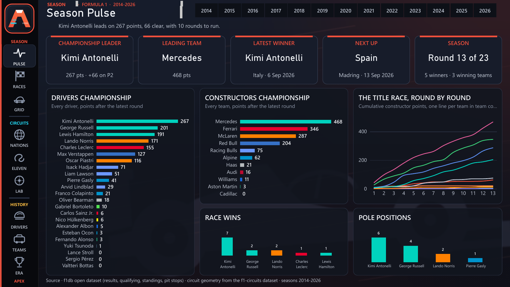

# APEX, Formula 1 Intelligence

[](https://github.com/abdoulhamiddiallo/apex-f1-intelligence/actions/workflows/build.yml)
[](LICENSE)
[](docs/data-sources.md)
[](docs/architecture.md)

A nine-page Power BI report on the 2014 to 2026 Formula 1 era, **generated entirely from
code**: 16 tables, 243 DAX measures, 597 visuals, real circuit geometry, livery colours on
every chart, and a build that reproduces itself byte for byte on any machine.



## What it is

Thirteen seasons, 275 Grands Prix on the calendar, 63 drivers and 24 teams, read from the open
[f1db](https://github.com/f1db/f1db) database and explored through nine pages:

| Section | Page | The question it answers |
|---------|------|-------------------------|
| Season | **Season Pulse** | Who leads right now, by how much, and how did the title race unfold round by round? |
| Season | **Race Results** | Every Grand Prix of a season on one screen: winner, team, pole, time. |
| Season | **Teams** | The grid of a season: position, points, wins, podiums, driver line-up. |
| Circuits | **Countries** | Which nations host Formula 1, how often, and since when? |
| Circuits | **Classic Eleven** | Eleven heritage circuits drawn from their real outline, with records. |
| Circuits | **Circuit Lab** | Pick a track: profile, lap record, masters, every race run there. |
| History | **Drivers** | Re-rank the era by any metric; where each driver starts and finishes on average. |
| History | **Constructors** | The constructor record, points by season, wins by engine. |
| History | **Formula 1** | The era at a glance: champions, who won what, reliability. |

[docs/pages.md](docs/pages.md) walks through each page.

## Why it is built this way

**Nothing in the report was drawn by hand.** `dist/APEX.pbip` is the output of a Python
package (`apex/`) that writes the semantic model as TMDL, the report as PBIR JSON, the data as
CSV and every image as PNG or inline SVG. The reasons:

* **Consistency at scale.** Six hundred visuals share one rail, one KPI strip, one type scale,
  one palette. A design change is one constant and a rebuild, not an afternoon of clicking.
* **Review like code.** PBIR stores one JSON file per visual. Because every identifier is a
  deterministic UUID v5 and the build is fully reproducible, a diff shows exactly what changed
  and nothing else.
* **Quality gates that a human cannot run.** `apex.validate` reads the model and the report
  back and refuses the build if a header would be truncated, a font size is not an integer,
  a DAX reference is broken, an image is not registered, two visuals overlap, or a dash of
  the wrong kind slipped into a label. The rules come from real Power BI behaviour and are
  documented in [docs/design-system.md](docs/design-system.md).
* **Reproducible, offline, portable.** The two data files travel in the repository with their
  checksums. `python build.py --check` builds twice and proves the outputs identical; the
  CI job does the same on a clean runner and rejects a commit whose `dist/` does not match.

[docs/architecture.md](docs/architecture.md) explains the pipeline, the star schema, the
DAX patterns and the PBIR layer in depth.

## Quick start

```bash
git clone https://github.com/abdoulhamiddiallo/apex-f1-intelligence.git
cd apex-f1-intelligence
pip install -r requirements.txt        # Pillow + CairoSVG (needs the Cairo library)
python build.py --check                # ~10 s: build, validate, rebuild, compare
python tools/set_data_folder.py        # point the model at this clone's dist/data
```

Then open `dist/APEX.pbip` in Power BI Desktop (PBIP preview feature enabled) and click
Refresh. Full instructions, including Windows notes, in [docs/build.md](docs/build.md).

## Under the bonnet

```
data/raw/f1db-csv.zip ─┐                        ┌─ dist/data/*.csv            15 tables
data/raw/f1-circuits ──┤  apex.data             │
assets/logos/*.png ────┤  apex.svg_columns  ────┼─ dist/APEX.SemanticModel/   TMDL, 243 measures
                       │  apex.model, measures  │
                       │  apex.logo, background │
                       └─ apex.report ──────────┴─ dist/APEX.Report/          9 pages, 597 visuals
                                  │
                           apex.validate ─── any defect fails the build
```

**Data.** A star schema shaped for the questions above: six dimensions, seven facts with
integer flags (`IsWin`, `IsPodium`, `IsPole`, `IsDNF`, ...), two disconnected tables that
drive the metric and scope slicers. Circuit outlines are GeoJSON rings projected onto a
square plane, stored as points (for the Circuit Lab scatter) and as SVG paths in an
`ImageUrl` column (for tables). Flags, badges and crests are SVG data URIs, so the report has
no external dependency at all.

**Model.** TMDL as Power BI Desktop writes it: typed and formatted columns, hidden keys,
`summarizeBy: none` on flags, `discourageImplicitMeasures`, a `DataFolder` parameter as the
only machine-specific value. 243 measures in 19 display folders, catalogued with their DAX
in [docs/measures.md](docs/measures.md). Patterns include zero-filled counts guarded by the
presence of results, split leaderboards through `RANKX` plus visual-level measure filters,
sentence-building text measures for the headline tiles, and colour measures that hand
livery colours to every chart.

**Report.** A small layout DSL (`kpi`, `table`, `bar`, `scatter`, `slicer`, `navbtn`, ...)
over the PBIR schemas. The 120 px navigation rail is a coordinate transform applied by
`Page.add`, so the page code never knew the rail grew. Every rendering rule learned the hard
way (integer sizes, full font stacks, text box and card heights, table width budgets, header
widths, tooltip behaviour on image columns) lives once in the generator and once in the
validator.

**Build.** `build.py` verifies the f1db checksum, runs the eight steps under
`PYTHONHASHSEED=0`, validates, and with `--check` rebuilds from scratch to prove
bit-identical output. The GitHub Actions workflow repeats that on Ubuntu, diffs the committed
`dist/`, regenerates the measure catalog and lints the repository (language, dashes, paths,
pinned dependencies).

## Gallery

| | |
|---|---|
|  |  |
|  |  |
|  |  |
|  |  |

Screenshots are Power BI Desktop's PDF export converted to PNG, not mock-ups.

## Repository

```
apex/           generator package: config, data, model, measures, pbir, report, validate, images
assets/logos/   24 team logos (PNG), embedded at build time
build.py        orchestrator and determinism check
data/raw/       f1db-csv.zip (v2026.13.0), f1-circuits.geojson, SHA256SUMS
dist/           the generated Power BI project: open APEX.pbip
docs/           architecture, data sources, build, design system, pages, measure catalog, screenshots
tools/          measures_catalog.py, repo_lint.py, set_data_folder.py, ast_compare.py
```

## Data and licences

* Code, generated definition and documentation: [MIT](LICENSE).
* Race data: [f1db](https://github.com/f1db/f1db) release v2026.13.0, CC BY 4.0, redistributed
  unmodified in `data/raw/`.
* Circuit geometry: [f1-circuits](https://github.com/bacinger/f1-circuits) by Tomislav Bacinger, MIT.
* Team logos are trademarks of their owners and are included for identification only; the
  build falls back to generated crests without them. See [NOTICE](NOTICE).

This is an independent project, not affiliated with Formula One Licensing B.V., the FIA or
any team. Details in [docs/data-sources.md](docs/data-sources.md).

## Author

**Abdoul Hamid Diallo**, data engineer (Power BI, Microsoft Fabric, SQL Server).
[LinkedIn](https://www.linkedin.com/in/abdoul-hamid-diallo-fabric-data-engineer/) ·
[GitHub](https://github.com/abdoulhamiddiallo)
