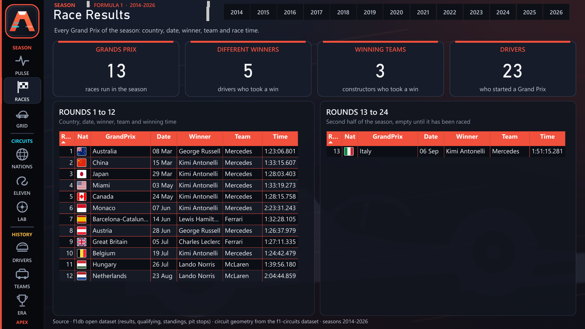
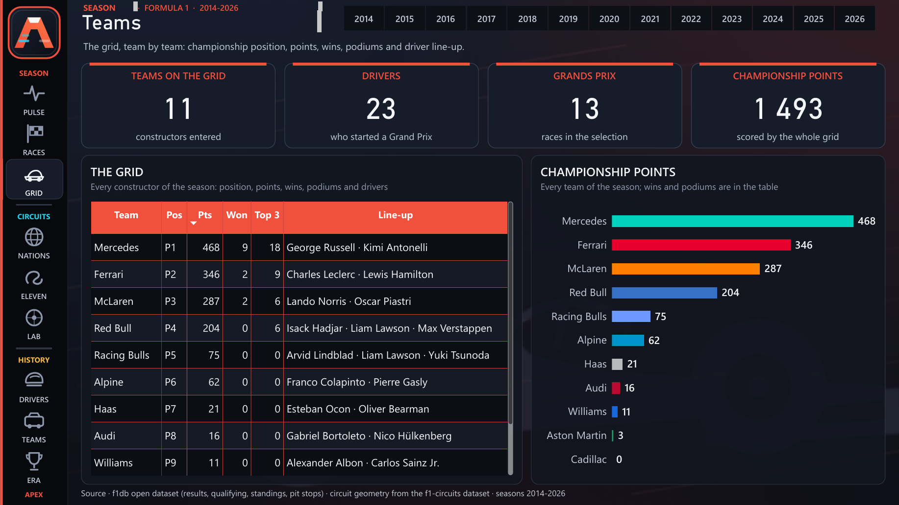
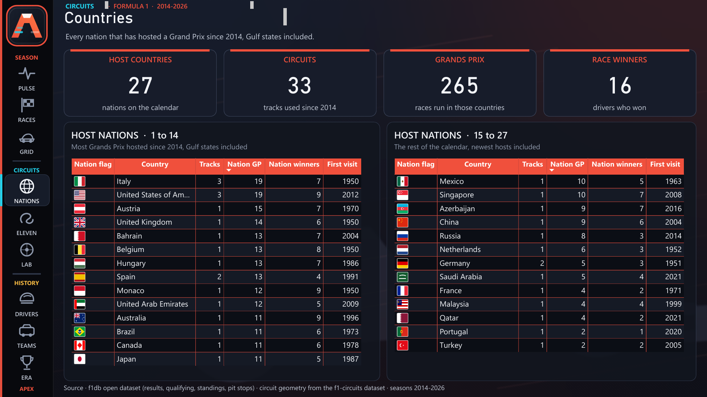
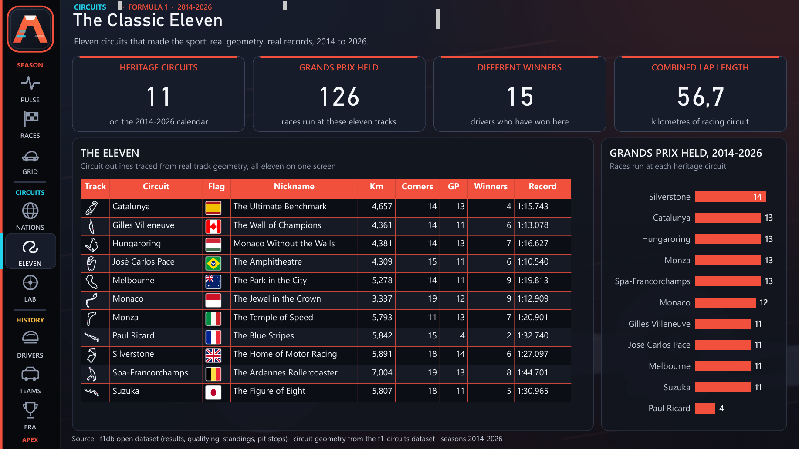
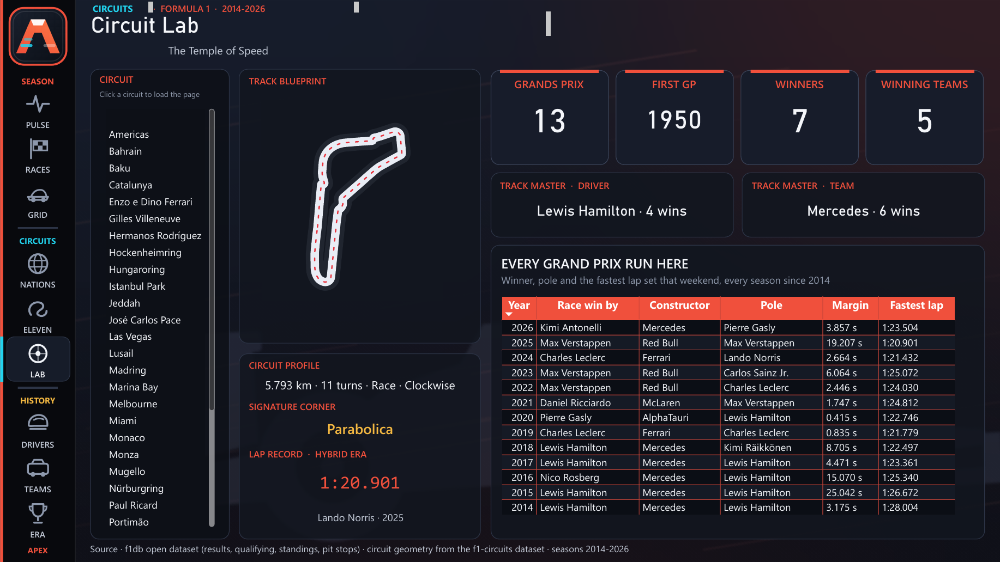
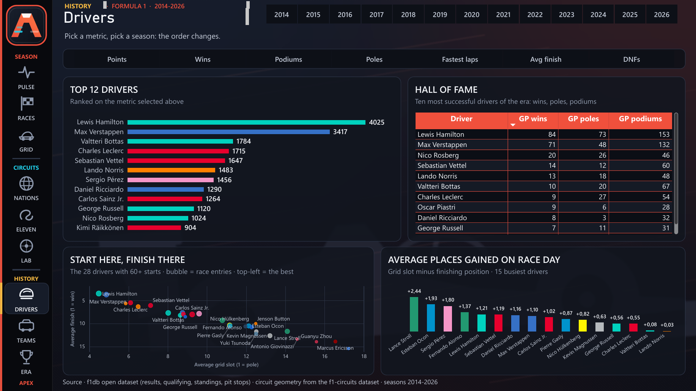
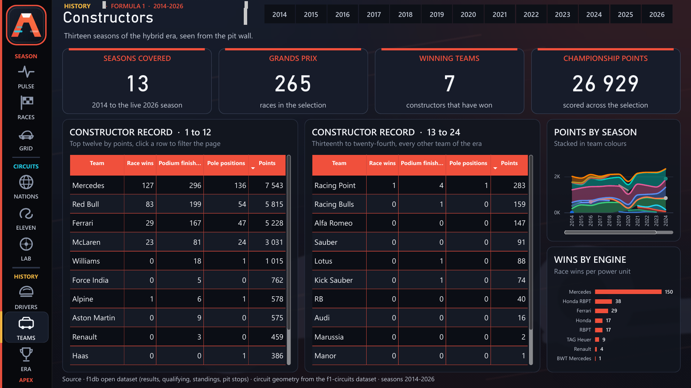
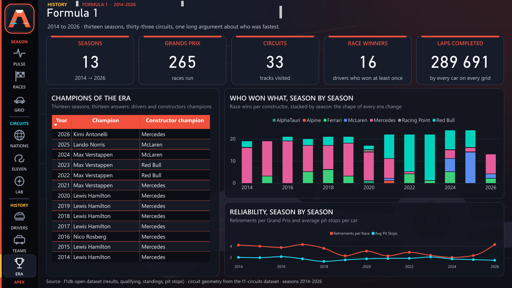

# The nine pages

The navigation rail on the left of every page groups the report in three sections of three
pages, each with its own accent colour: **Season** (coral), **Circuits** (cyan), **History**
(amber). Every page shares the same chrome: an eyebrow line, a large title, a one-line
subtitle written by a measure or fixed text, a KPI strip, then two rows of panels.

Screenshots come from Power BI Desktop's own PDF export (File > Export > Export to PDF),
rasterised page by page with `pdftoppm -r 110` and cropped to the canvas; nothing is mocked up.
The numbering follows the navigation rail.

## Season

### 1. Season Pulse

The live page. A season slicer (defaulting to the current season) drives a text headline
written by DAX ("X leads on N points, G clear, with R rounds to run"), four story tiles
(leader, leading team, last winner, next Grand Prix), the drivers' and constructors'
championship as bars in livery colours, the title race round by round as a line chart of
cumulative points, and race wins and pole positions per driver. Everything on the page
follows the slicer; nothing is hard-coded to a year.

### 2. Race Results

Every Grand Prix of the selected season in two side-by-side tables (rounds 1 to 12, rounds
13 to 24): round, host flag, Grand Prix, date, winner, winning team and race time. The split
is a measure filter on the round number, so a 24-round calendar fits on one screen with no
scrolling.

### 3. Teams

The grid of the selected season: each team with its championship position, points, wins,
top-three finishes and driver line-up, plus championship points as bars in livery colours.
The line-up is concatenated by a measure, so a mid-season replacement appears automatically.

## Circuits

### 4. Countries

Every nation that has hosted a Grand Prix since 2014: flag, number of circuits used, number
of Grands Prix since 2014, different winners and the year of the first Formula 1 visit ever,
in two ranked tables (host nations 1 to 14 and 15 to 27).

### 5. Classic Eleven

Eleven heritage circuits, each drawn from its real geometry (an SVG path stored in the model),
with host flag, nickname, length, corners, Grands Prix held since 2014, different winners and
the era's lap record. A bar chart compares the number of Grands Prix each one has hosted.

### 6. Circuit Lab

Pick one circuit from the list on the left and the page rebuilds itself: the outline as a
scatter chart (so it inherits the theme and reacts to selection), the profile (length, turns,
type, direction), the signature corner, the lap record set in the era with its holder, the
number of Grands Prix, different winners and teams, the most successful driver and team, and
the table of every Grand Prix run there with winner, constructor, pole sitter, winning margin
and fastest lap.

## History

### 7. Drivers

A metric slicer (points, wins, podiums, poles, fastest laps, average finish, DNFs) and a
season slicer re-rank the top 12 drivers as bars in livery colours. The Hall of Fame table
lists the ten most successful drivers of the era (wins, poles, podiums); the scatter "Start
here, finish there" plots average grid position against average finish for every driver
with at least 60 starts, coloured by team;
the last panel shows the average places gained on race day.

### 8. Constructors

The constructor record of the era in two ranked tables (1 to 12, 13 to 24): team, race wins,
podium finishes, pole positions and points, filtered by the season slicer. A stacked area
chart shows points by season per team, and a bar chart counts wins by engine manufacturer.

### 9. Formula 1

The era at a glance: seasons, Grands Prix, circuits, different winners and laps completed;
the drivers' and constructors' champions of every season; who won what, season by season,
as stacked columns per team; and reliability season by season (retirements per Grand Prix
and average pit stops per car).
